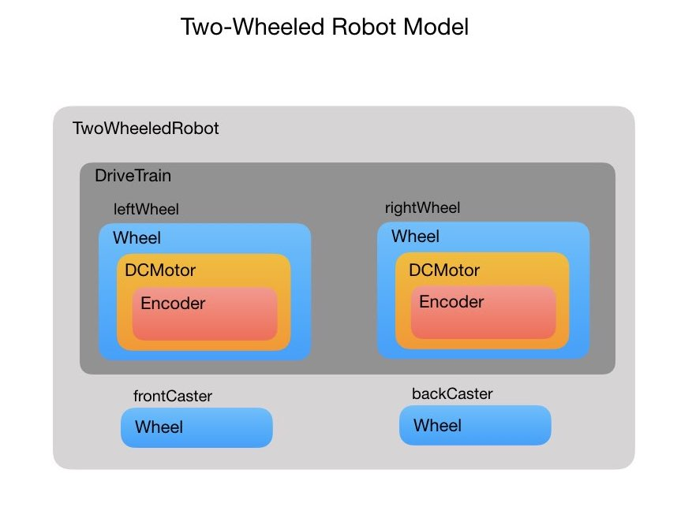
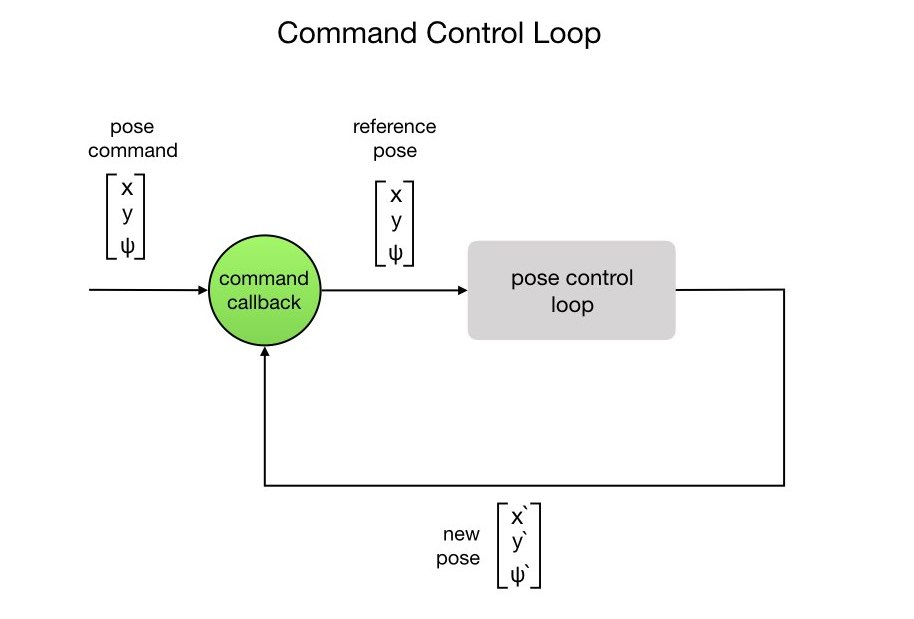
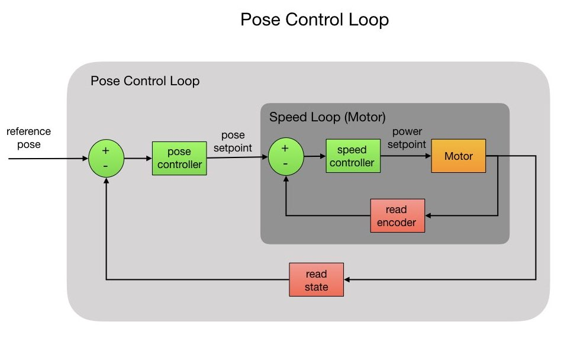

# Two Wheeled robot programming

This project describe the programming for Two Wheeled diffrenital drive robot, the programming will be with C++. 

## Block Digrame for our robot!

so we have 2 driver wheel and 2 castor wheel,
2 driver wheel have 2 encoder conected with 2 DC Motors.

## Control Loop

let's describe the control loop we are used to control the speed, position and orientation of robot. 
the loop will wait to recive a command that sends to a control loop to change the robot pose(position, orientation).

## Pose Control Loop

the pose control loop tells the robot how fast it should spin each wheel and this will follow to speed control loop that determies how much power needs to apply.

